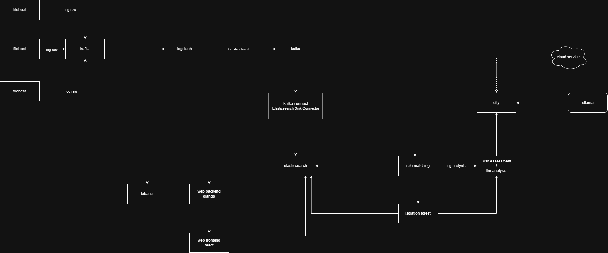

# AuditWeaver

> A log analysis platform based on AI and Dify.

[](#license)
[]()
[]()

English | [简体中文](README.zh-CN.md)

***

## 📖 Overview

AuditWeaver is an AI-powered log analysis system designed for distributed cluster environments. It collects log data from multiple servers and processes the logs intelligently through rule matching, anomaly detection, and large language model (LLM) analysis. The system identifies potential security risks, attack activities, attack processes, and attack intent, helping security analysts quickly locate security incidents. By automating log analysis and security monitoring, AuditWeaver improves the efficiency of security operations and enhances the overall protection of distributed systems.

***

## ✨ Features

- 📥 Collect logs from distributed servers
- 🔍 Detect known attacks with rule matching (SQL injection, XSS, command injection, path traversal, etc.)
- 🤖 Identify anomalous behaviors using Isolation Forest
- ⚖️ Assess security risks automatically
- 🧠 Analyze suspicious logs with LLMs (Dify Workflow)
- 📄 Generate structured security reports
- 🔄 Real-time data pipeline based on Kafka + Kafka Connect
- 🐳 Support Docker deployment with one-click startup
- 🔐 Manage configuration through environment variables

***

## 🏗 Architecture
current verion V1.0.0  
current architecture:


***
V2 architecture:


## 🛠 Tech Stack

| Category      | Technology    |
| :------------ | :------------ |
| Backend       | Django + Django REST Framework |
| Frontend      | Next.js + TypeScript |
| AI Analysis   | Dify Workflow / Ollama |
| Rule Engine   | Python Regex + YAML-based rules |
| Anomaly Detection | Isolation Forest (scikit-learn) |
| Message Queue | Apache Kafka |
| Data Integration | Kafka Connect (Elasticsearch Sink) |
| Log Pipeline  | Logstash |
| Search & Storage | Elasticsearch |
| Visualization | Kibana |
| Container     | Docker Compose |

***

## 📂 Project Structure

```text
AuditWeaver/
├── common/              # Common code and resources
│   ├── env.py           # Environment variable configuration
│   └── time_utils.py    # Timezone utility (multi-timezone support)
├── docker/              # Docker configuration
│   ├── config/
│   │   ├── elasticsearch/   # ES mappings and initialization
│   │   ├── kafka/           # Kafka topics configuration
│   │   ├── kafka-connect/   # Kafka Connect connectors
│   │   └── logstash/        # Logstash pipeline
│   └── docker-compose.yml
├── docs/                # Documentation
├── resources/           # Dify workflow resources
├── scripts/             # Startup/Management scripts
│   ├── config.py        # Service configuration
│   ├── docker_manager.py # Docker lifecycle manager
│   └── utils.py         # Utility functions
├── services/            # Microservices
│   ├── agent/           # AI analysis module (Dify integration)
│   ├── ruleEngine/      # Rule matching engine
│   ├── isolationForest/ # Anomaly detection model
│   ├── riskAssessment/  # Risk assessment module
│   └── website/         # Web platform (Django + Next.js)
├── .env.example         # Environment variable template
├── start.py             # One-click startup script (Python)
├── start.bat            # One-click startup script (Windows)
├── stop.bat             # Stop script (Windows)
├── requirements.txt
├── README.md
└── .gitignore
```

***

## 🚀 Quick Start

### 1. Prerequisites

Before you start, please ensure that you have the following dependencies installed:

- Python 3.11+
- Node.js 18+ (for Next.js frontend)
- Docker & Docker Compose
- A running Dify platform (or Ollama for local LLM)

### 2. Clone the repository

```bash
git clone https://github.com/yourname/AuditWeaver.git
cd AuditWeaver
```

### 3. Install Python dependencies

```bash
pip install -r requirements.txt
```

### 4. Install frontend dependencies (optional, for development)

```bash
cd services/website/frontend/v1
npm install
cd ../../..
```

### 5. Configure Dify platform

Upload the workflow file to your Dify platform:

```
resources/dify/logs analysis.yml
```

### 6. Create environment variables

```bash
cp .env.example .env
```

Edit the `.env` file and configure:
- `DIFY_API_KEY`: Your Dify API Key
- `DIFY_BASE_URL`: Dify API base URL
- Other services ports as needed

### 7. Start all services

```bash
python start.py
```


The startup script will automatically:
1. Start all Docker Compose services (Kafka, Elasticsearch, Kibana, Logstash, Kafka Connect)
2. Wait for Elasticsearch and Kafka to be ready
3. Initialize Kafka topics and Elasticsearch indexes
4. Initialize Kafka Connect connectors
5. Start Rule Engine, Agent module, Django backend, and Next.js frontend

Once started, access:
- Dashboard Frontend: http://localhost:3000
- Django Backend API: http://localhost:8000
- Kibana: http://localhost:5601

***

## ⚙ Configuration

### Core Environment Variables

| Variable                  | Description                          | Default     |
| :------------------------ | :----------------------------------- | :---------- |
| DJANGO_SECRET_KEY         | Django secret key                    | -           |
| DJANGO_DEBUG              | Django debug mode                    | True        |
| DJANGO_PORT               | Django backend port                  | 8000        |
| ES_HOST                   | Elasticsearch host                   | localhost   |
| ES_PORT                   | Elasticsearch port                   | 19200       |
| KAFKA_BROKERS             | Kafka brokers                        | localhost:29092 |
| KAFKA_CONNECT_HOST        | Kafka Connect host                   | localhost   |
| KAFKA_CONNECT_PORT        | Kafka Connect REST API port          | 8083        |
| KAFKA_TOPIC_RAW           | Kafka topic for raw logs             | log.raw     |
| KAFKA_TOPIC_STRUCTURED    | Kafka topic for structured logs      | log.structured |
| KAFKA_TOPIC_ANALYSIS      | Kafka topic for analysis results     | log.analysis |
| KAFKA_TOPIC_RISK          | Kafka topic for risk assessment     | log.risk    |
| DIFY_BASE_URL             | Dify API base URL                    | http://localhost/v1 |
| DIFY_API_KEY              | Dify API Key                         | -           |
| NEXT_PUBLIC_API_BASE      | Frontend API base URL                | http://localhost:8000 |

> See `.env.example` for all available options.

### Kafka Topics

| Topic                 | Description                                    |
| :-------------------- | :--------------------------------------------- |
| log.raw               | Raw log data input                             |
| log.structured        | Structured/parsed logs (via Logstash)           |
| log.audit             | Logs to be processed by the Rule Engine        |
| log.analysis          | Analysis results from the Rule Engine           |
| rule.event.save       | Rule Engine events (ES sink target)            |

> Topics are auto-initialized via `docker/config/kafka/topics/topics.yaml` and `create-init-topics.py`.
> Agent AI analysis reports are written directly to the MySQL `analysis_report` table (no Kafka/ES hop).

### Elasticsearch Indexes

| Index                    | Description                              |
| :----------------------- | :--------------------------------------- |
| nginx-log-raw            | Raw Nginx logs                           |
| matched_logs             | Logs matched by rules                    |

> AI-generated analysis reports are stored in MySQL table `analysis_report` (Django app `reports`). The report detail view still reads the raw log line (`event.original`) from `nginx-log-raw`.

***

## 📸 Screenshots

Dashboard


Analysis Report


***

## 🤝 Contributing

Contributions are welcome!

1. Fork the project
2. Create your feature branch
3. Commit your changes
4. Open a Pull Request

***

## 📄 License

This project is licensed under the Apache 2.0 License.

***

## 🙏 Acknowledgements

- [Dify](https://github.com/langgenius/dify) - LLM Application Platform
- [Elasticsearch](https://www.elastic.co/) - Search and Analytics
- [Kafka](https://kafka.apache.org/) - Distributed Message Queue
- [Logstash](https://www.elastic.co/logstash) - Data Processing Pipeline
- [Django](https://www.djangoproject.com/) - Python Web Framework
- [Next.js](https://nextjs.org/) - React Framework
- [scikit-learn](https://scikit-learn.org/) - Isolation Forest Anomaly Detection

***

## ⭐ Support

If you find this project useful, please consider giving it a ⭐ on GitHub.
