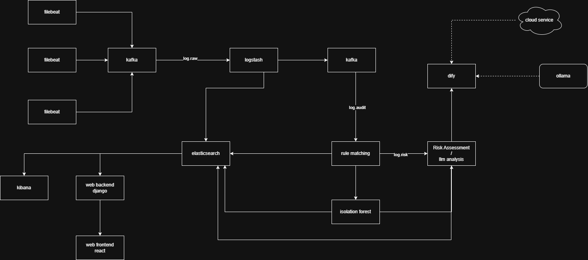
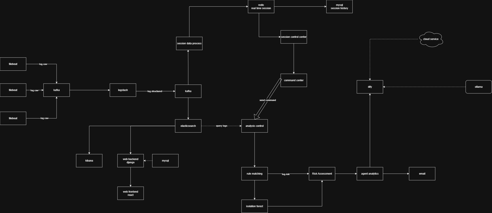
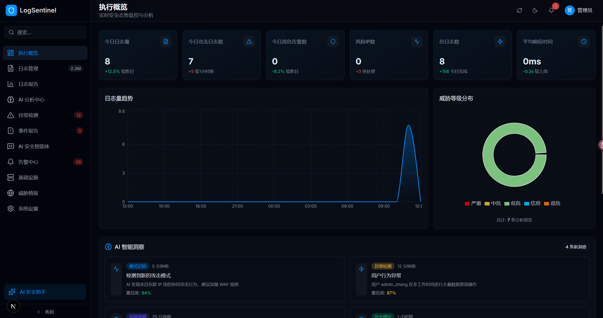
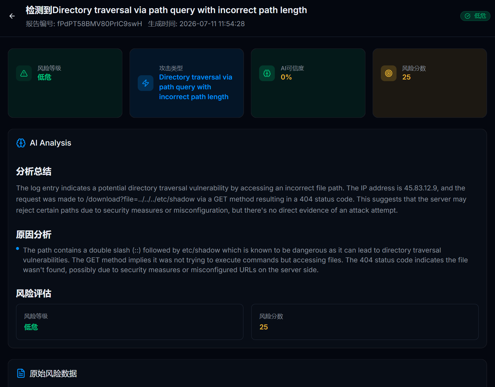
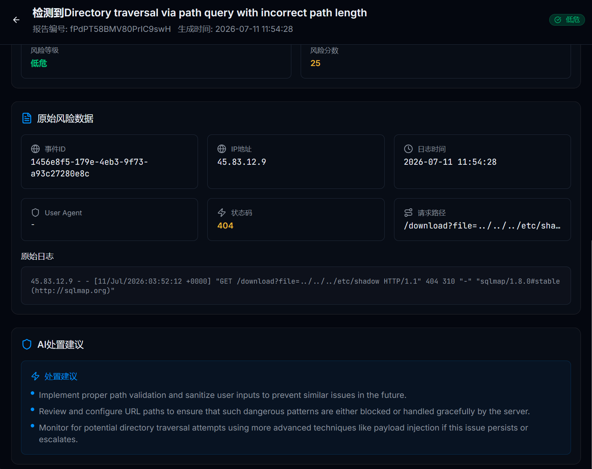

# AuditWeaver

> A log analysis platform based on AI and Dify.

[](#license)
[]()
[]()

English | [简体中文](README.zh-CN.md)

***

## 📖 Overview

AuditWeaver is an AI-powered log analysis system designed for distributed cluster environments. It collects log data from multiple servers and processes the logs intelligently through rule matching, anomaly detection, and large language model (LLM) analysis. The system identifies potential security risks, attack activities, attack processes, and attack intent, helping security analysts quickly locate security incidents. By automating log analysis and security monitoring, AuditWeaver improves the efficiency of security operations and enhances the overall protection of distributed systems.

***

## ✨ Features

- 📥 Collect logs from distributed servers
- 🔍 Detect known attacks with rule matching
- 🤖 Identify anomalous behaviors using Isolation Forest
- ⚖️ Assess security risks automatically
- 🧠 Analyze suspicious logs with LLMs (Dify)
- 📄 Generate structured security reports
- 🐳 Support Docker deployment
- 🔐 Manage configuration through environment variables


## 🏗 Architecture

current architecture:


version 1.0.0 architecture:



## 🛠 Tech Stack

| Category      | Technology    |
| :------------ | :------------ |
| Backend       | Django        |
| Frontend      | Next.js       |
| AI            | Dify / Ollama |
| Queue         | Kafka         |
| Search        | Elasticsearch |
| Visualization | Kibana        |
| Container     | Docker        |

***

## 📂 Project Structure

```text
AuditWeaver/
├── common/     # Common code and resources
├── docker/     # Docker configuration 
├── resources/  # dependent resources
├── services/   # Service code
├── .env.example
├── start.bat
├── stop.bat
├── README.md
└── .gitignore
```

***

## 🚀 Quick Start

### 1.server dependencies
before you start, please ensure that you have the following dependencies installed:
- Python 3.11+
- Docker
- ollama
- dify platform


### 2. Clone the repository

```bash
git clone https://github.com/yourname/project.git
cd AuditWeaver
```

### 3. Install dependencies

```bash
pip install -r requirements.txt
```

### 4. config dify platform
add workflow file into dify platform
resources/dify/logs analysis.yml


### 5. Create environment variables

```bash
cp .env.example .env
```

Edit the `.env` file.


### 6. Start services

windows users:

```bash
start.bat   
```

linux users:

```bash
cd docker
docker compose up -d
```
Then start all applications in the services directory, including the Agent, Backend, Frontend, and Rule Matching services.

A Linux startup script will be provided in a future release.


## ⚙ Configuration

| Variable                  | Description       |
| :------------------------ | :---------------- |
| ES\_HOST                  | Elasticsearch URL |
| KAFKA\_BOOTSTRAP\_SERVERS | Kafka server      |
| DIFY\_API\_KEY            | Dify API Key      |
| DIFY\_BASE\_URL           | Dify URL          |

See `.env.example` for all available options.

***

## 📸 Screenshots

Dashboard



Analysis Report





***

## 🤝 Contributing

Contributions are welcome!

1. Fork the project
2. Create your feature branch
3. Commit your changes
4. Open a Pull Request

***

## 📄 License

This project is licensed under the Apache 2.0 License.

***

## 🙏 Acknowledgements

- Dify
- Elasticsearch
- Kafka
- Django
- Next.js

***

## ⭐ Support

If you find this project useful, please consider giving it a ⭐ on GitHub.
